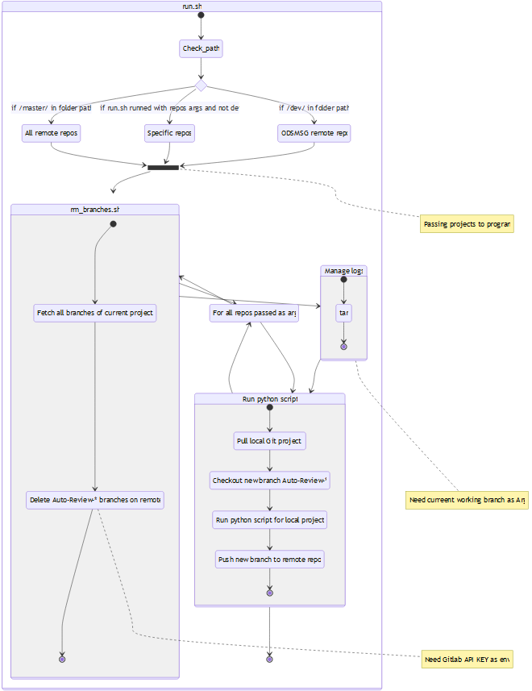
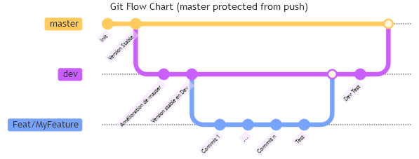
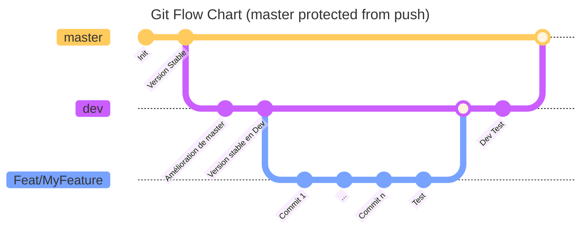

# Auto-Review ReadTheDocs :call_me_hand:

Project developped to format ReadTheDocs Gitlab repos to fit with established nomenclature. [ReadTheDocs](https://<gitlab_url>/sdoppe/deploiements/docs-projets)

Each time this script is launched a new branch named `Auto-Review-<Date>_<time>` is created on remote repository.

This nomenclature documentation is readable [there](http://<doc_url>/fr/RTD/NomenclatureRTD).
This nomenclature has been restablished and released by Julien RAYNAL - AC75098488 - julien.raynal-externe@acoss.fr


[[_TOC_]]

## Scripts :pencil:

Environment is strongly advertise to be run in PyEnv.
```shell
python -m pip install --proxy <My Proxy Address> venv
python -m venv <My PyEnv>
```

### Bash :shell:
- [run.sh](./run.sh): Main bash script. It can be run with args or not. If no args, then run on all `hwi6_*` remote repos, else specify specific repos like `./run.sh hwi6_accrdv hwi6_odsmsg`
- [rm_branches.sh](./rm_branches.sh): Remove all `Auto-review-*` remote branches from specified repos
- [log_all.sh](./log_all.sh): Manage logs and tar them
- [auto-review.sh](./auto-review.sh): Manage Git local and remote commands && run auto-review Python Script

### Python :snake:
- [main.py](./main.py): Python script performing folder managment

### Others
- [requirements.txt](./requirements.txt): Contain all Python dependances
```shell
python -m pip --proxy <My Proxy Address> -r requirements.txt
```
- [prospector.yml](./.prospector.yml): Define prospector rules. [What is prospector ?](https://prospector.landscape.io/en/master/)
```shell
prospector <Folder>
```
- [.gitlab-ci.yml](./.gitlab-ci.yml): Define Gitlab CI/CD. [What is Gitlab CI/CD ?](https://docs.gitlab.com/ee/ci/)

## Folder architecture :open_file_folder:

```
|-- src/
|   |-- templates/
|   |   |--  mkdocs.yml.j2  -> mkdocs.yml Jinja2 template
|-- __init__.py             -> Module initialisation file : define logger 
|-- arguments.py            -> Read program arguments
|-- checks.py               -> Check all problems, and resolves them
|-- compare.py              -> Compare YML for non regression
|-- constants.py            -> All constants needed
|-- files.py                -> File managment
|-- folders.py              -> Folder managment
|-- lot.py                  -> Lot managment
|-- override.py             -> Overrides methods to log 
|-- yaml.py                 -> Define YAML dumper
```

## State Chart
<!-- 
```mermaid
---
title: Execution steps
---
stateDiagram-v2
    state "run.sh" as run
    state "rm_branches.sh" as rm_branches

    state run {
        state "ODSMSG remote repo" as ODSMSG
        state "Specific repos" as specific_args
        state "All remote repos" as All

        state if_state <<choice>>
        state join_state <<join>>

        [*] -> Check_path
        Check_path -> if_state

        if_state -> ODSMSG: if /dev/ in folder path
        if_state -> specific_args: if run.sh runned with repos args and not dev
        if_state -> All: if /master/ in folder path

        note right of join_state: Passing projects to program

        ODSMSG -> join_state
        specific_args -> join_state
        All -> join_state

        join_state -> rm_branches

        state "For all repos passed as arg" as if_state_loop
        rm_branches -> if_state_loop
        if_state_loop -> rm_branches

        state rm_branches {
            state "Fetch all branches of current project" as fetch
            state "Delete Auto-Review-* branches on remote" as delete_all

            note right of delete_all: Need Gitlab API KEY as env

            [*] -> fetch
            fetch -> delete_all
            delete_all -> [*]
        }

        rm_branches -> log_all

        state "Manage logs" as log_all
        note right of log_all: Need curreent working branch as Arg

        state log_all {
            [*] -> tar
            tar -> [*]
        }

        state "Run python script" as auto_review
        log_all -> auto_review

        auto_review -> if_state_loop
        if_state_loop -> auto_review
        
        state auto_review {
            state "Pull local Git project" as pull
            state "Checkout new branch Auto-Review-*" as checkout
            state "Run python script for local project" as python
            state "Push new branch to remote repo" as push

            [*] -> pull
            pull -> checkout
            checkout -> python
            python -> push
            push -> [*]
        }

        auto_review -> [*]        
    }
```
-->



## Git Flow Chart to respect :bar_chart:



<!--

-->